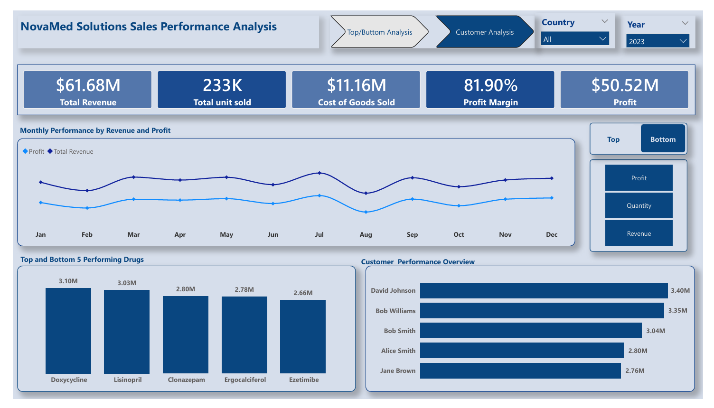
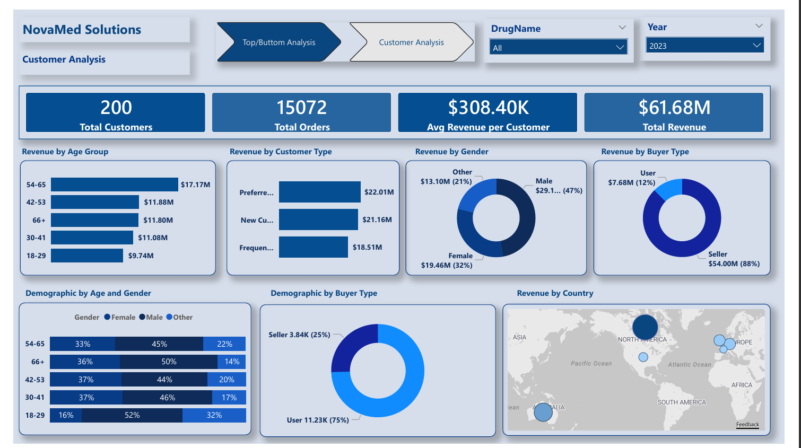

# 📊 Power BI Capstone Project: Business Performance Analysis

---

## 📌 Project Overview

NovaMed is a leading pharmaceutical distributor that serves a diverse healthcare sector, ensuring the availability of essential medications across various countries. The company is facing challenges in optimizing sales performance, customer engagement, managing inventory efficiently, and identifying key market opportunities, which has impacted operational effectiveness.
The project simulates a real-world business scenario where stakeholders require clear visibility into key performance metrics and growth opportunities

## 📌 Project Goal

This project delivers data-driven insights for NovaMed Solutions by analysing operational and customer data to identify inefficiencies, optimize performance, and improve customer engagement.

---

## 🎯 Objectives

* Analyse overall business performance across customers, regions, and product categories
* Develop overall sales metrics
* Track trends in customer behaviour and sales patterns
* Build an interactive dashboard for stakeholder reporting

---

## 🧰 Tools & Technologies

* **Power BI** – Data visualisation and dashboard development
* **Excel** – Data cleaning and preprocessing

---

## 📁 Dataset

* Source: [Provided by training institution for capstone project]
* Data Tables:

  * FactTables: Contains transactional information (
  * DrugLookup: Contains all drug-related information (DrugID, DrugName, treats)
  * CustomerTables: Contains information about customers ( age, gender, customerID, Country)
 

---

## 🔄 Data Preparation

* Removed duplicates and handled missing values
* Standardised date formats and categorical variables
* Created calculated columns and measures in Power BI (e.g. Total Sales, Profit Margin, YoY Growth)

---

## 📊 Dashboard Features

The Power BI dashboard includes:

* **KPI Overview**

  * Total Revenue
  * Total Profit
  * Profit Margin

* **Sales Trends**

  * Monthly and yearly performance
  * Seasonal patterns

* **Regional Analysis**

  * Revenue distribution by location
  * Top-performing regions

* **Product Performance**

  * Best-selling categories
  * Low-performing products

* **Customer Insights**

  * Segment analysis
  * Purchasing behaviour

---

## 📸 Dashboard Preview

---

## 🔍 Key Insights

* The company generated total revenue of approximately $61.68 million and a profit of about $50.52 million. This resulted in a high profit margin of approximately 82%, 
indicating strong cost efficiency and an effective pricing strategy.

* The business is geographically concentrated, relying heavily on top performing countries (Canada and Australia). There is a large gap between the top and bottom countries, indicating uneven market penetration.
  
* The least demography of buyer type (Seller) contributes the highest revenue. This indicates that loosing a few customers in the seller segment will result in a major revenue drop.

* The top 5 drugs contribute a significant portion of total revenue, showing that the business relies heavily on a few key products. The top 5 drugs contributed approximately $17 million (27%) of Total revenue,  while the Bottom 5 drugs contributed about $2 million ( 3% )of Total revenue

---

## 💡 Recommendations

* Focus on high-performing product categories to maximise profitability
* Investigate underperforming regions and optimise marketing strategies
* Leverage seasonal trends for inventory and campaign planning
* Develop targeted offers for different customer segments

---

## 🧠 Skills Demonstrated

* Data cleaning and transformation
* Data modelling in Power BI
* DAX calculations and measures
* Data visualisation and dashboard design
* Translating data into business insights

---

## 🚀 Future Improvements

* Integrate real-time data sources
* Incorporate predictive analytics (forecasting sales trends)
* Enhance dashboard interactivity with advanced filters
* Expand analysis with additional datasets

---

## 📬 Contact

* LinkedIn: [https://www.linkedin.com/in/mustabshira-awal1]
* Email: [mustabshiraawal96@gmail.com]

---
